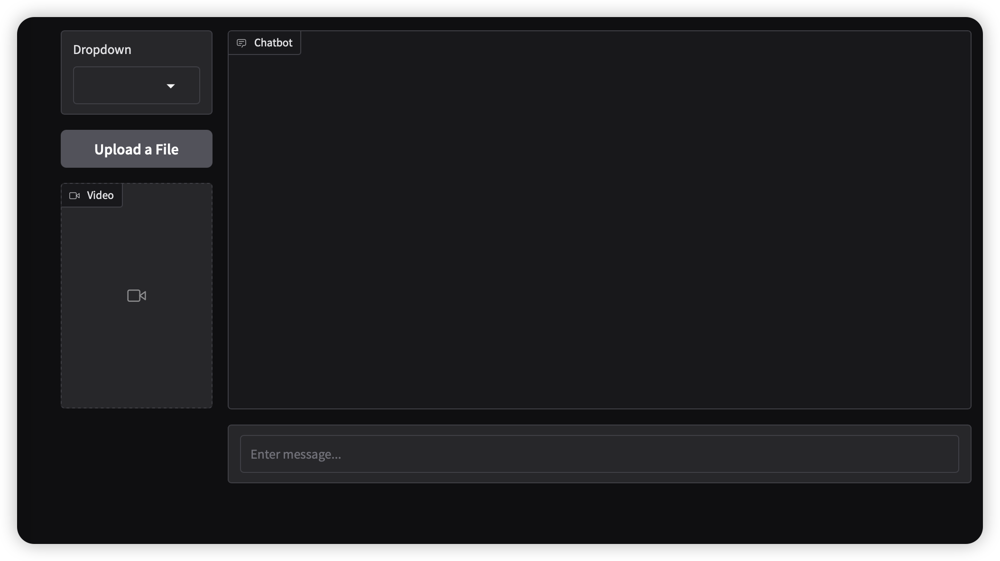

<p align="center">
  
</p>

<div>
    <h1 align="center">🌟 Build Multimodal Language Agents with Ease 🌟</h1>
</div>


<p align="center">
  <a href="https://twitter.com/intent/follow?screen_name=OmAI_lab" target="_blank">
    
  </a>
  <a href="https://discord.gg/G9n5tq4qfK" target="_blank">
    
  </a>
</p>


## 📖 Introduction  
OmAgent is python library for building multimodal language agents with ease. We try to keep the library **simple** without too much overhead like other agent framework.   
 - We wrap the complex engineering (worker orchestration, task queue, node optimization, etc.) behind the scene and only leave you with a super-easy-to-use interface to define your agent.   
 - We further enable useful abstractions for reusable agent components, so you can build complex agents aggregating from those basic components.   
 - We also provides features required for multimodal agents, such as native support for VLM models, video processing, and mobile device connection to make it easy for developers and researchers building agents that can reason over not only text, but image, video and audio inputs. 

## 🔑 Key Features  
 - A flexible agent architecture that provides graph-based workflow orchestration engine and various memory type enabling contextual reasoning.  
 - Native multimodal interaction support include VLM models, real-time API, computer vision models, mobile connection and etc.   
 - A suite of state-of-the-art unimodal and multimodal agent algorithms that goes beyond simple LLM reasoning, e.g. ReAct, CoT, SC-Cot etc.   
 - Supports local deployment of models. You can deploy your own models locally by using Ollama[Ollama](./docs/concepts/models/Ollama.md) or [LocalAI](./examples/video_understanding/docs/local-ai.md).
 - Fully distributed architecture, supports custom scaling. Also supports Lite mode, eliminating the need for middleware deployment.


## 🛠️ How To Install
- python >= 3.10
- Install omagent_core  
  Use pip to install omagent_core latest release.
  ```bash
  pip install omagent-core
  ```
  Or install the latest version from the source code like below.
  ```bash
  pip install -e omagent-core
  ```

## 🚀 Quick Start 
### Configuration

The container.yaml file is a configuration file that manages dependencies and settings for different components of the system. To set up your configuration:

1. Generate the container.yaml file:
   ```bash
   cd examples/step1_simpleVQA
   python compile_container.py
   ```
   This will create a container.yaml file with default settings under `examples/step1_simpleVQA`. For more information about the container.yaml configuration, please refer to the [container module](./docs/concepts/container.md)

2. Configure your LLM settings in `configs/llms/gpt.yml`:

   - Set your OpenAI API key or compatible endpoint through environment variable or by directly modifying the yml file
   ```bash
   export custom_openai_key="your_openai_api_key"
   export custom_openai_endpoint="your_openai_endpoint"
   ```
   You can use a locally deployed Ollama to call your own language model. The tutorial is [here](docs/concepts/models/Ollama.md).

### Run the demo

1. Run the simple VQA demo with webpage GUI:

   For WebpageClient usage: Input and output are in the webpage
   ```bash
   cd examples/step1_simpleVQA
   python run_webpage.py
   ```
   Open the webpage at `http://127.0.0.1:7860`, you will see the following interface:  
   

## 🤖  Example Projects
### 1. Video QA Agents
Build a system that can answer any questions about uploaded videos with video understanding agents. we provide a gradio based application, see details [here](examples/video_understanding/README.md).  
<p >
  
</p>

More about the video understanding agent can be found in [paper](https://arxiv.org/abs/2406.16620).
<p >
  
</p>


### 2. Mobile Personal Assistant
Build your personal mulitmodal assistant just like Google Astral in 2 minutes. See Details [here](docs/tutorials/agent_with_app.md).
<p >
  
</p>


### 3. Agentic Operators
We define reusable agentic workflows, e.g. CoT, ReAct, and etc as **agent operators**. This project compares various recently proposed reasoning agent operators with the same LLM choice and test datasets. How do they perform? See details [here](docs/concepts/agent_operators.md).

| **Algorithm** |  **LLM**  | **Average** | **gsm8k-score** | **gsm8k-cost($)** | **AQuA-score** | **AQuA-cost($)** |
 | :-----------------: | :------------: | :-------------: | :---------------: | :-------------------: | :------------------------------------: | :---: |
 |       SC-COT       |  gpt-3.5-turbo  |       73.69       |         80.06         |                            5.0227                            | 67.32 | 0.6491 |
|         COT        |  gpt-3.5-turbo  |       69.86       |         78.70         |                            0.6788                            | 61.02 | 0.0957 |
|      ReAct-Pro      |  gpt-3.5-turbo  |       69.74       |         74.91         |                            3.4633                            | 64.57 | 0.4928 |
 |         POT         |  gpt-3.5-turbo  |       64.42       |         76.88         |                            0.6902                            | 51.97 | 0.1557 |
 |         IO*        |  gpt-3.5-turbo  |       38.40       |         37.83         |                            0.3328                            | 38.98 | 0.0380 |

*IO: Input-Output Direct Prompting (Baseline)  

More Details in our new repo [open-agent-leaderboard](https://github.com/om-ai-lab/open-agent-leaderboard) and [Hugging Face space](https://huggingface.co/spaces/omlab/open-agent-leaderboard)


## 💻 Documentation
More detailed documentation is available [here](https://om-ai-lab.github.io/OmAgentDocs/).

## 🤝 Contributing
For more information on how to contribute, see [here](CONTRIBUTING.md).  
We value and appreciate the contributions of our community. Special thanks to our contributors for helping us improve OmAgent.

<a href="https://github.com/om-ai-lab/OmAgent/graphs/contributors">
  
</a>

## 🔔 Follow us
You can follow us on [X](https://x.com/OmAI_lab), [Discord](https://discord.gg/G9n5tq4qfK) and WeChat group for more updates and discussions.  
<p >
  
</p>


## 🔗 Related works
If you are intrigued by multimodal large language models, and agent technologies, we invite you to delve deeper into our research endeavors:  
🔆 [How to Evaluate the Generalization of Detection? A Benchmark for Comprehensive Open-Vocabulary Detection](https://arxiv.org/abs/2308.13177) (AAAI24)   
🏠 [GitHub Repository](https://github.com/om-ai-lab/OVDEval/tree/main)

🔆 [OmDet: Large-scale vision-language multi-dataset pre-training with multimodal detection network](https://ietresearch.onlinelibrary.wiley.com/doi/full/10.1049/cvi2.12268) (IET Computer Vision)  
🏠 [Github Repository](https://github.com/om-ai-lab/OmDet)

## ⭐️ Citation

If you find our repository beneficial, please cite our paper:  
```angular2
@article{zhang2024omagent,
  title={OmAgent: A Multi-modal Agent Framework for Complex Video Understanding with Task Divide-and-Conquer},
  author={Zhang, Lu and Zhao, Tiancheng and Ying, Heting and Ma, Yibo and Lee, Kyusong},
  journal={arXiv preprint arXiv:2406.16620},
  year={2024}
}
```
