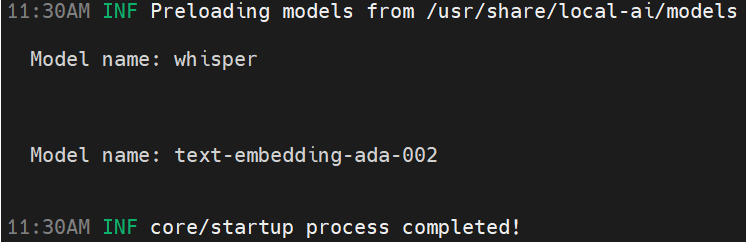

# Local-ai
You can use Local-ai to run your own model locally.
Following the instruction of [Local-ai](https://github.com/mudler/LocalAI) to install Local-ai.

### Download Local-ai models
Download [Whisper](https://huggingface.co/ggerganov/whisper.cpp) and [Embedding model](https://huggingface.co/hugging-quants/Llama-3.2-1B-Instruct-Q4_K_M-GGUF). 
Then move the model checkpoint file to the /usr/share/local-ai/models/. **Other path for models is not supported.**

### Modify config files
Create Local-ai config files.

Embedding model yaml
```yaml
name: text-embedding-ada-002
backend: llama-cpp
embeddings: true
parameters:
  model: llama-3.2-1b-instruct-q4_k_m.gguf # model file name in /usr/share/local-ai/models/
```
Whisper yaml
```yaml
name: whisper
backend: whisper
parameters:
  model: ggml-model-whisper-base.en.bin # model file name in /usr/share/local-ai/models/
```
### run the model
First run
```bash
local-ai run <path-to-your-embedding-model-yaml>
```
and
```bash
local-ai run <path-to-your-whisper-yaml>
```
to initially link yaml file to the model.

Then next time only run
```bash
local-ai run
```
can load two models.

**Make sure get model names right, or embedding model may get empty result.**


### Modify the yaml of OmAgent
Modify ./configs/llms/json_res.yml
```yaml
name: OpenaiTextEmbeddingV3
model_id: text-embedding-ada-002
dim: 2048
endpoint: ${env| custom_openai_endpoint, http://localhost:8080/v1}
api_key: ${env| custom_openai_key, openai_api_key} # api_key is not needed
```
and ./configs/workers/video_preprocessor.yml
```yaml
name: VideoPreprocessor
llm: ${sub|gpt4o}
use_cache: true
scene_detect_threshold: 27
frame_extraction_interval: 5
stt:
  name: STT
  endpoint: http://localhost:8080/v1
  api_key: ${env| custom_openai_key, openai_api_key}
  model_id: whisper
output_parser: 
  name: DictParser
text_encoder: ${sub| text_encoder}
```
and set dim in ./container.yaml
```yaml
  VideoMilvusLTM:
    name: VideoMilvusLTM
    id:
      value: null
      env_var: ID
    storage_name:
      value: yyl_video_ltm
      env_var: STORAGE_NAME
    dim:
      value: 2048
      env_var: DIM
```

Then you can use your model locally.
